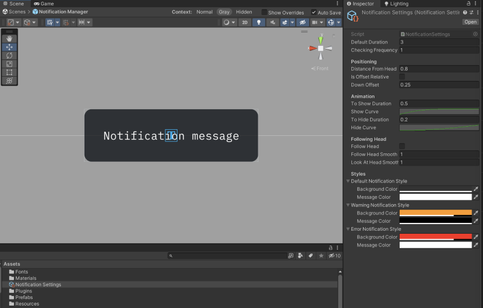

# XR Notification System

Simple easy-to-use Notification System for your wonderful XR project.

Originally, I developed this package for [VR Boxel Editor](https://twitter.com/Volorf/status/1305406161710125056).


# How to install the package
Easy-peasy:

1. Copy Git URL
2. Open `Window/Package Manager`
3. Add VR Notifications package via `Add package from git URL`


# How to add it to your project

Super simple. Find the `Notification Manager` prefab and drop it into your scene.


# How to send a notification

I love binding `SendMessage` to UnityEvents to make it decoupled as mush as possible.

```csharp
using System;
using UnityEngine.Events;

// Create a custom Unity Event
[Serializable]
public class NotificationEvent: UnityEvent<string> {}
```

```csharp
using UnityEngine;

public class MyScript : MonoBehaviour
{
    [SerializeField] private string MyMessage = "Space has been pressed.";
    // Expose the custom Unity Event in the Editor
    [SerializeField] private NotificationEvent MyEvent;

    private void Update()
    {
        if (Input.GetKeyDown(KeyCode.Space))
        {
            MyEvent.Invoke(MyMessage);
        }
    }
}
```


Also, since `Notification Manager` is `Singleton`, you can call its methods without having a direct reference to the object. Very straightforward:

```csharp
private void Update()
{
    if (Input.GetKeyDown(KeyCode.Space))
    {
        NotificationManager.Instance.SendMessage("Space has been pressed.");
    }
} 
```


# How to set up it

All properties are in a Scriptable Object Asset called "Notification Settings". 



I found it very useful to have multiple data assets when you tweak values a lot during the design iterations. Don't need to recompile the script each time you made changes.

To create `Notification Settings`, go to `Create` / `Create Notification Settings`. Then drop the asset to the `Notification Manager`.


# Contacts
[Twitter](https://www.twitter.com/volorf) | [Linkedin](https://www.linkedin.com/in/oleg-frolov-6a6a4752/) | [Dribbble](https://dribbble.com/Volorf) | [Personal Site](https://olegfrolov.design/)


