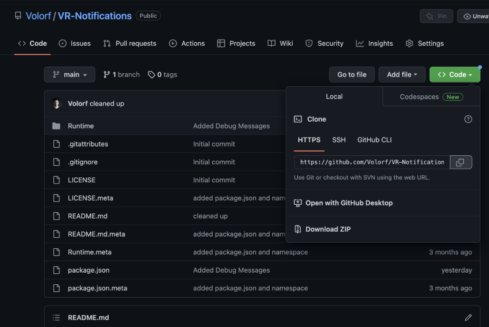
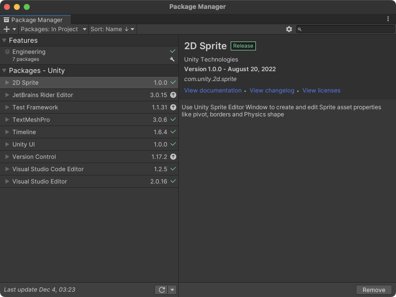
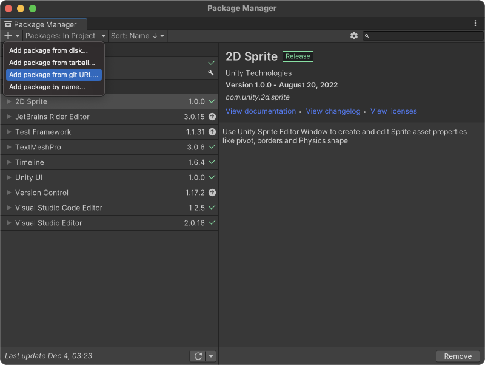
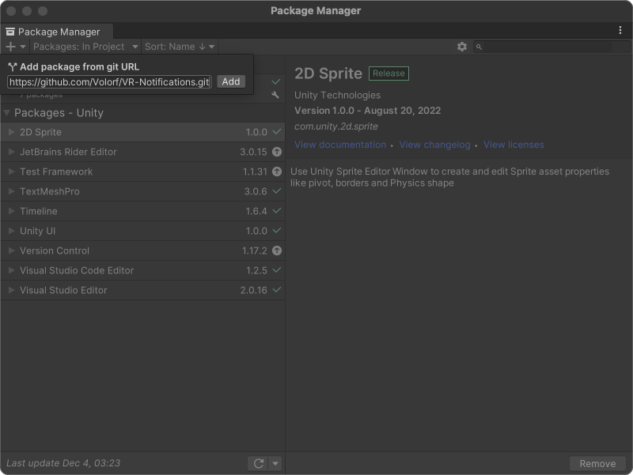

# VR Notification System

Simple easy-to-use Notification System for your wonderful VR project.

Originally, I developed this package for [VR Boxel Editor](https://twitter.com/Volorf/status/1305406161710125056).


# How to install the package

Just 3 steps:

#### 1. Copy Git URL


#### 2. Open ```Window/Package Manager```


#### 3. Add VR Notifications package via ```Add package from git URL```




# How to add VR Notification to your project
Super simple. Find the ```VR Notification``` prefab and drop it into your scene.


# How to send a notification
Personally, I love binding the ```SendMessage(<T> m)``` methods to UnityEvents to make it decoupled as mush as possible.

But since VR Notification object is ```Singleton``` and its methods are static, you can call them without having a direct reference to the object. ~~Single~~ Simple like this:

```csharp
private void Start()
{
    Notification.Instance.SendMessage("Hello World!");
}
```


# How to set up it
All properties are in a Scriptable Object Asset. I found it very useful especially when you tweak values during the design iteration without recomplining the script each time you made changes and you can store diffrent versions of the values while you do the design experiments.

### How to create ```Notificatation Settings```


### How to add the Settings


# Links
[Portfolio](https://olegfrolov.design/) | [Linkedin](https://www.linkedin.com/in/oleg-frolov-6a6a4752/) | [Dribbble](https://dribbble.com/Volorf) | [Twitter](https://www.twitter.com/volorf) 


